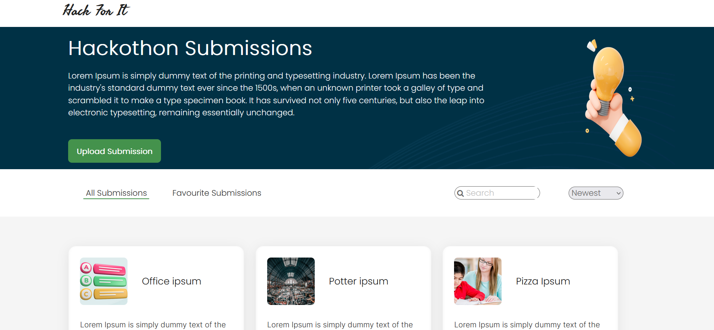
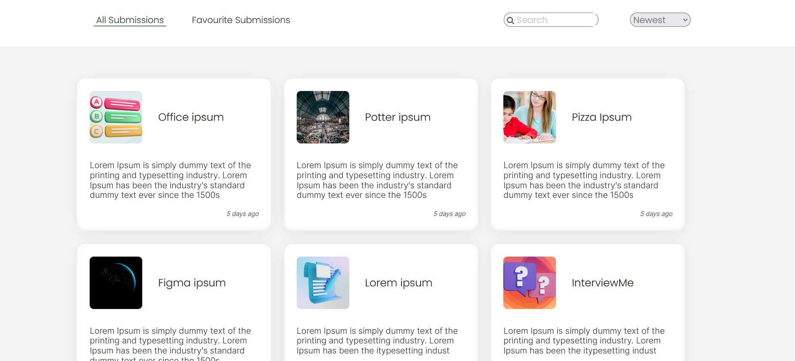
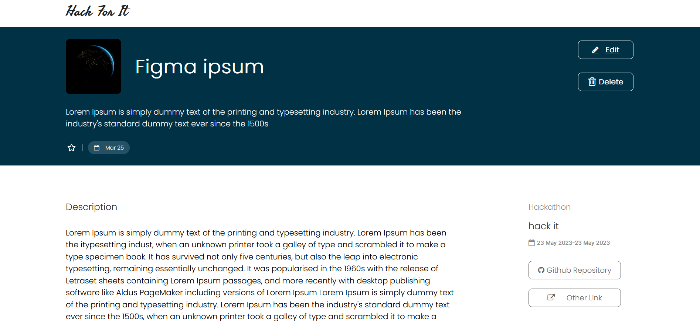

<h1>Hack For It</h1>

<h4>Portal for your hackathon proposal submission</h4>

 
Search other's submission.You can also make a list of your favourite submission.

   
   
   
  
Get the idea about other proposal

   
   
   
   
   
Get the details of other's submissions

   
   
   
   Live APP: https://hackforit.netlify.app/
